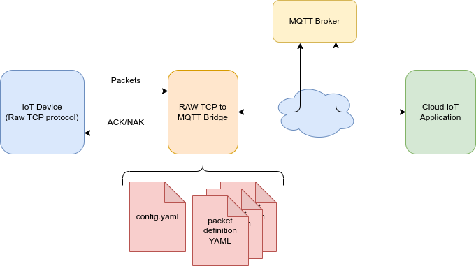

## Overview

The `rawtcp_to_mqtt_bridge` project provides a robust and flexible solution for connecting devices or systems that communicate via a generic binary TCP protocol to modern IoT infrastructures based on MQTT. This bridge enables seamless integration between legacy or custom devices and MQTT brokers, facilitating data exchange, monitoring, and control in distributed environments.

## Purpose

Many industrial, embedded, or custom devices use simple TCP protocols to send and receive data. However, the rapid adoption of MQTT as a standard in modern IoT ecosystems creates the need to interconnect these two worlds. This project solves that problem by converting TCP data streams into MQTT messages and vice versa, allowing legacy devices to participate in MQTT-based systems without firmware or hardware modifications.

---

## The Need for Lightweight Protocol Bridges in IoT

As IoT expands, many devices—especially those deployed in the field or industrial settings—must operate with limited resources and restricted networks. Cellular networks, for example, are often the only option in remote sites and require using extremely simple binary protocols to save bandwidth, energy, and complexity.

### Why Use Simple Protocols?

- **Bandwidth Efficiency:** Complex protocols increase traffic and cost on metered networks.
- **Hardware Limitations:** Many embedded devices have little memory and CPU.
- **Energy Savings:** Short, simple messages allow radios to be active less time, extending device life.
- **Simplicity:** Raw TCP with basic framing (like SLIP) is easy to implement even on modest microcontrollers.

### The Integration Challenge

These binary protocols, while efficient, are incompatible with modern cloud platforms that expect standardized, rich interactions like MQTT. MQTT enables publish/subscribe semantics, QoS, retention, and easy integration with dashboards and automation.

Bridging TCP and MQTT is crucial for:

- **Modernizing legacy systems** without costly firmware changes.
- **Scaling cloud-connected solutions** on top of existing devices.
- **Enabling remote monitoring, control, and analytics** using mature MQTT tools.

---

## Architecture Diagram

Below is a diagram illustrating the architecture and data flow:



**Legend:**
- Devices use lightweight binary TCP protocols, with SLIP framing for robustness.
- Data crosses potentially unreliable or costly networks (cellular, satellite).
- The bridge receives SLIP-framed data, decodes it, and publishes MQTT messages.
- The MQTT broker distributes messages to dashboards, applications, or cloud services.

---

## SLIP: Framing and Robustness in Heterogeneous Networks

SLIP (Serial Line Internet Protocol) is used to delimit packets on the TCP stream. It is extremely simple, efficient, and enables automatic resynchronization if bytes are lost—ideal for unreliable links.

**SLIP Framing Example:**

```
+-----+-----------+-----+-----------+-----+-----------+
| END | PAYLOAD 1 | END | PAYLOAD 2 | END | PAYLOAD 3 |
+-----+-----------+-----+-----------+-----+-----------+
```
- Each payload ends with a special END byte (0xC0).
- If the END is lost, the receiver waits for the next one to resynchronize.

**SLIP Resynchronization Visualization:**


sequenceDiagram
    participant Device
    participant Bridge
    Note right of Device: Sends SLIP packets<br>with END delimiters
    Device->>Bridge: [DATA1][END][DATA2][END]
    Note over Bridge: Network loses part of DATA2
    Device->>Bridge: [DATA3][END]
    Note over Bridge: Bridge detects missing END,<br>resynchronizes at next END


---

## Features and Capabilities

- **TCP to MQTT Bridging:** Listens for raw TCP connections and forwards the data as MQTT messages to configurable topics.
- **Protocol Agnostic:** Can work with any device or software that uses a basic TCP stream.
- **SLIP Framing:** Uses SLIP for packet delimitation, enabling automatic resynchronization and robustness.
- **Configurability:** Customize TCP ports, MQTT broker, topic mapping, and more using YAML files.
- **Multi-Client Support:** Handles multiple simultaneous TCP connections.
- **Cross-Platform:** Developed mainly in C++, with auxiliary scripts in Python and CMake.

---

## Project Structure

```plaintext
rawtcp_to_mqtt_bridge/
├── src/        # Core C++ code (TCP, SLIP, MQTT)
├── include/    # Headers for modularity
├── python/     # Auxiliary scripts for testing/configuration
├── CMakeLists.txt  # Build configuration
└── README.md   # Documentation
```

---

## Specifying the Binary TCP Protocol and Mapping to MQTT Templates

A core feature of `rawtcp_to_mqtt_bridge` is the ability to flexibly define binary TCP packet structures and transform them into MQTT messages. This is achieved by describing packet formats in YAML files, allowing the bridge to parse binary streams and publish them into MQTT topics according to user-defined templates.

### How to Specify Binary TCP Protocols

Packet structures are specified in YAML files within the `packets/` directory (see the `packet_defs` section in your `config.yaml`). Each YAML file defines one or more packet types, including binary layout, field types, offsets, and the corresponding MQTT topic and payload format.

#### Example: Defining a Sensor Data Packet

```yaml
sensor_data:
  mqtt:
    topic: "sensors/data_sensor_{{sensor_id}}"
    payload: |
      {
        "temperature": {{temperature}},
        "humidity": {{humidity}},
        "pressure": {{pressure}}
      }
  fields:
    - name: packet_type
      type: uint8
      offset: 0
      value: 0x10  # Identifier

    - name: sensor_id
      type: uint16
      offset: 1

    - name: temperature
      type: float32
      offset: 3

    - name: humidity
      type: float32
      offset: 7

    - name: pressure
      type: float32
      offset: 11
```

**Explanation:**
- Each field has a name, type, and offset in the binary packet.
- The `packet_type` field acts as an identifier (here, 0x10).
- The `mqtt` section defines:
  - The topic template (topics can use field values, e.g., `sensor_id`)
  - The payload template (typically JSON, rendered with field values)

### Example: Binary Packet and MQTT Mapping

If the device sends these bytes (big-endian):

| Offset | Data (hex)           | Field         | Decoded Value    |
|--------|----------------------|---------------|------------------|
| 0      | 10                   | packet_type   | 0x10             |
| 1-2    | 00 01                | sensor_id     | 1                |
| 3-6    | 41 20 00 00          | temperature   | 10.0             |
| 7-10   | 42 48 00 00          | humidity      | 50.0             |
| 11-14  | 42 70 00 00          | pressure      | 60.0             |

The bridge:
- Recognizes `packet_type` as 0x10 (sensor_data).
- Parses all fields by type and offset.
- Publishes:

**Topic:** `sensors/data_sensor_1`

**Payload:**
```json
{
  "temperature": 10.0,
  "humidity": 50.0,
  "pressure": 60.0
}
```

### Example: Bitfields and Arrays

You can define advanced structures like bitfields (flags) or arrays for more complex layouts:

```yaml
device_status:
  mqtt:
    topic: "devices/status/{{device_id}}"
    payload: |
      {
        "flags": {{flags}},
        "voltage": {{voltage}}
      }
  fields:
    - name: packet_type
      type: uint8
      offset: 0
      value: 0x20

    - name: device_id
      type: uint8
      offset: 1

    - name: flags
      type: uint8
      offset: 2
      bitfield:
        bit_offset: 0
        bit_count: 8

    - name: voltage
      type: float32
      offset: 3
```

### How the Bridge Uses the Template

- The bridge identifies packets by their unique identifier field (`value` in `fields`, e.g., `packet_type: 0x10`).
- It extracts each field based on type and offset, supporting types like `uint8`, `uint16`, `float32`, and even arrays.
- The extracted values are injected into the MQTT topic and payload templates using the [inja](https://github.com/pantor/inja) template engine.
- This enables dynamic MQTT topics and rich JSON payloads, making it easy to integrate with any MQTT-based backend.

### More on Packet Definitions

- All packet definition YAMLs are loaded from the paths and patterns configured in `config.yaml` under `packet_defs`.
- You can group definitions by type (sensors, commands, status) to scale and organize.

**For more examples, see the [`README.md` on GitHub](https://github.com/martinribelotta/rawtcp_to_mqtt_bridge/blob/main/README.md).**

---

## Problem Solved

Connecting legacy or proprietary devices to modern IoT platforms is a frequent challenge in industrial automation, smart buildings, and research. Many lack native MQTT or publish/subscribe support. This bridge eliminates the need for custom firmware/middleware, speeding up integration and reducing complexity. It enables modernization and unlocks the power of cloud analytics and management.

In scenarios where data usage matters (cellular, satellite), the use of simple binary protocols and SLIP framing ensures efficiency and robustness. The bridge not only translates between worlds but also adds resilience, ideal for variable environments.

---

## Use Cases

- **Industrial equipment:** Sensors send data via TCP and reach the cloud via MQTT.
- **Home automation:** TCP devices can interact with MQTT controllers.
- **Prototyping:** Developers can use simple TCP and later integrate into MQTT infrastructure.
- **Field IoT:** Benefit from SLIP resynchronization for intermittent links.
- **Modernization:** Integrate legacy devices into dashboards and cloud services without firmware changes.

---

## Data Flow Example


sequenceDiagram
    participant Device as Legacy Device
    participant Bridge as rawtcp_to_mqtt_bridge
    participant Broker as MQTT Broker
    participant Cloud as Cloud Platform

    Device->>Bridge: TCP Packet (SLIP-encoded)
    Bridge->>Bridge: Decodes SLIP, extracts payload
    Bridge->>Broker: Publishes to MQTT Topic
    Broker->>Cloud: Forwards to dashboards, apps, etc.
    Cloud-->>Broker: (Optional) Send commands/config
    Broker-->>Bridge: MQTT message for device
    Bridge->>Bridge: Encodes with SLIP
    Bridge->>Device: TCP Packet (SLIP-encoded)


---

## Possible Improvements

Although the bridge already provides essential capabilities, there are many ways to enhance it:

- **Encryption:**: TLS/SSL for TCP and MQTT, securing communication over public networks.
- **Authentication:**: Mechanisms to authenticate TCP clients and limit unauthorized access.
- **Compression:**: Configurable compression (e.g., zlib) to further reduce data usage.
- **Bidirectional MQTT→TCP Communication:**: Improved support for sending commands/config from MQTT to TCP devices.
- **Protocol Translation and Validation:**: Advanced parsing/validation for intelligent bridging.
- **Advanced Monitoring and Logging:**: Integration with monitoring systems and detailed logging for troubleshooting.
- **High Availability and Scalability:**: Support for redundant deployment, clustering, or load balancing.

---

## Conclusion

`rawtcp_to_mqtt_bridge` is a practical, open-source tool that connects the legacy world of binary TCP with the modern, scalable world of MQTT. Its focus on efficiency, robustness, and flexibility makes it ideal for modernizing installations and enabling data-driven applications even in the most demanding environments.

As the IoT ecosystem evolves, bridges like this will be critical to integrate the old with the new, extending the life and value of existing assets, and enabling truly connected, intelligent solutions.

---
