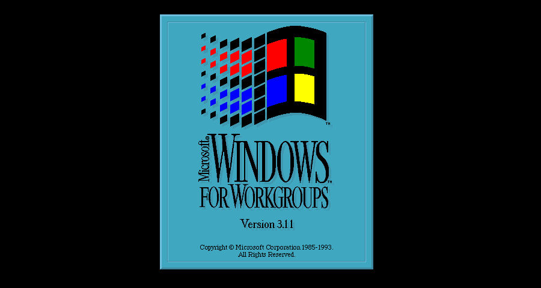
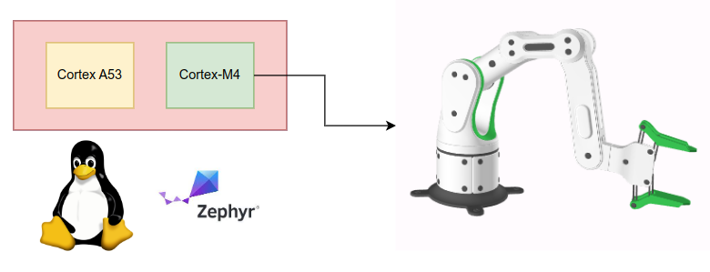
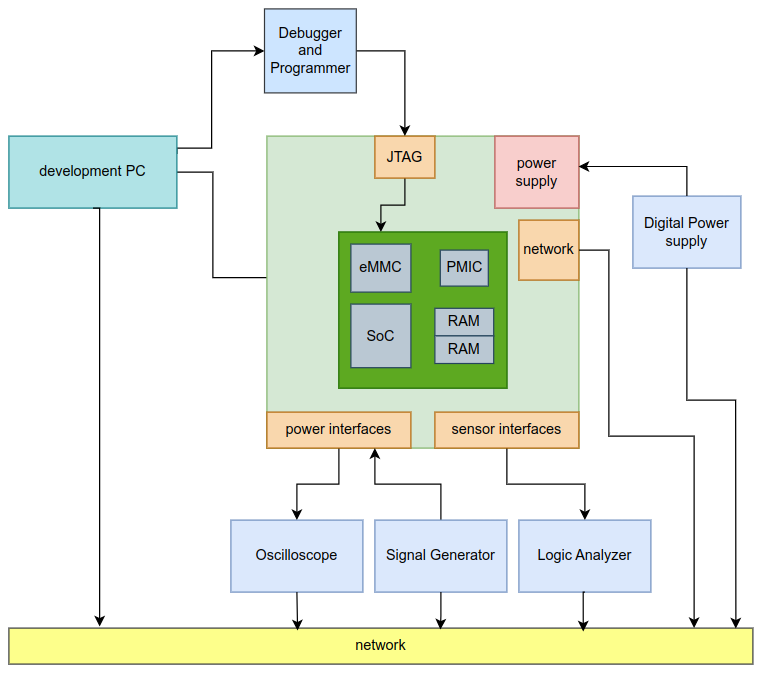

+++
author = "Martin Ribelotta"
title = "Remote build environment for workgroups"
date = 2024-03-25T21:22:03-03:00
description = ""
layout = "single"
draft = true
tags = [ "embedded", "build", "system development", "develop experiences" ]
+++

The development of embedded systems is becoming increasingly complex as new tools interact in intricate ways, making it challenging to replicate the build environment on developers' machines. This complexity is magnified when the development team is heterogeneous, consisting of 
machines running Windows, Linux, and/or MacOS.

A good example could be a project involving the co-design of application software and embedded software on an asymmetric SoC containing a Cortex-A53 and a coprocessor like Cortex-M4. In this scenario, the Cortex-A53 could be running a graphics-rich user interface on embedded Linux, while the microcontroller handles critical real-time tasks for controlling a 6-DoF (degrees of freedom) robot arm.

This project uses buildroot for generate an embedded Linux image with minimal footprint, high performance and all drivers of the SoC (propietary and open source). In the other size, the embedded MCU runs Zephyr OS with custom hard real-time application for control the 6DoF ARM

To develop the entire application image, you need a Buildroot environment on a Linux machine with Git, a Linux cross-toolchain, various system tools, a Zephyr environment with the corresponding embedded toolchain, and a programmer to flash and debug the application over JTAG. Additionally, you'll need to deal with two toolchains, various proprietary binary packages, tons of libraries, a plethora of build systems (such as Make, CMake, QMake, Autotools), and myriad software packages (BusyBox, Linux kernel, Qt, GLIBC, systemd), along with their corresponding patches (pieces of code that modify the pristine code of the problematic package to solve some issues or incompatibilities).

Additionally, consider that your team is distributed around the world and needs to manufacture, test, and ship boards (often expensive) to various key locations where your developers are located. Always ensuring that your development teams have the necessary testing equipment with them (logic analyzers, power supplies, oscilloscopes, various testers, not to mention programmers and debuggers).

Adn this is not the worst case, imagine this situation with more complex setup adding more boards, some special hardware like sensors or really expensive board like Zynq UltraScale+ (over a few thousands of USD) with MPU+MCU+FPGA development (adding a synthesis workflow to the process)

# Dealing with distributed teams

The traditional way to deal with the previous problem is: Simply not dealing with it. A central headquarters is established where all equipments are located (sometimes even in clean rooms), and those who want to develop with them must do so on-site.

Cleanly, the hardware-software co-design have a big issue with a distributed teams. But in the era of home-working, global talents and outsourcing, the inability to leverage this can result in a significant loss of competitiveness. In this scenario, effectively managing distributed teams is crucial.

## Centralize hardware storage, decentralize development via remote access

A better approach to dealing with a large development team without replicating hardware in many locations is to provide remote access to a central development environment mounted in a controlled and well-provisioned lab.

This implies various challenges around the remote access, hardware control and issue contention:

 - The development hardware is not functional at all times: Many crashes, hangups and communication issues can turno your setup blinded to remote access.
 - Measure of external conditions is essentially an in place activity. Many equipments have network or usb interaction but is uncommon and missued feature.
 - 