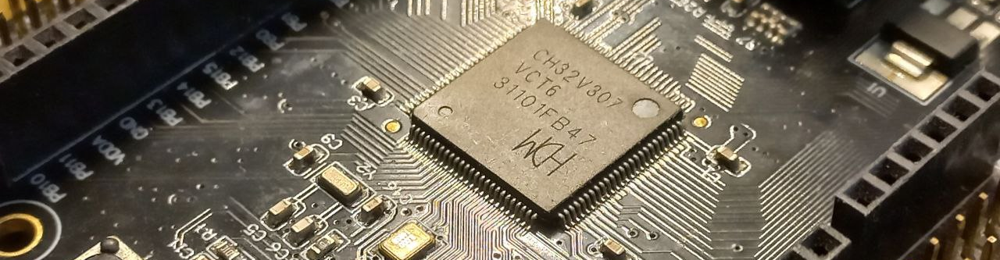
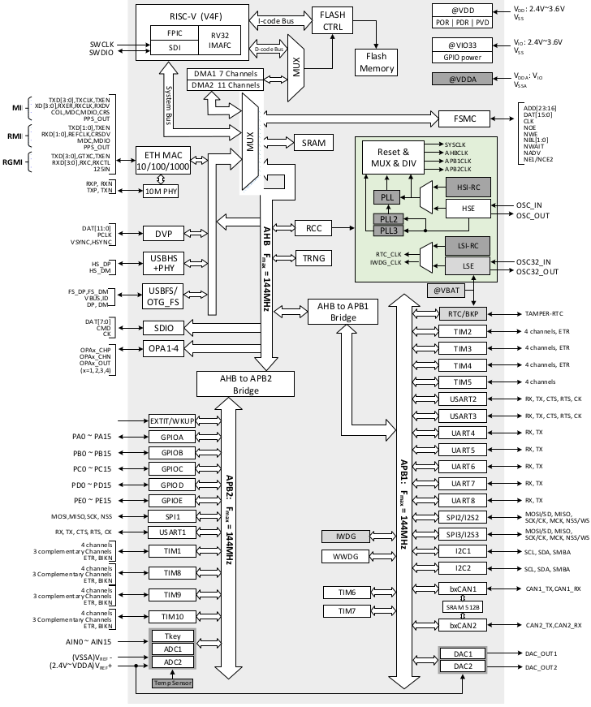
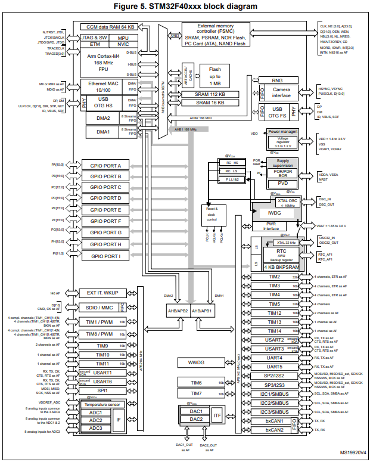
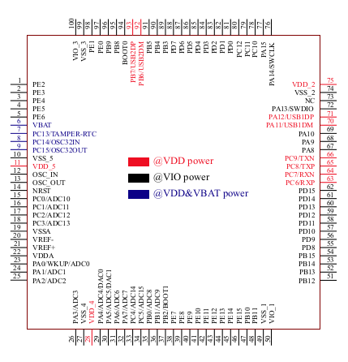
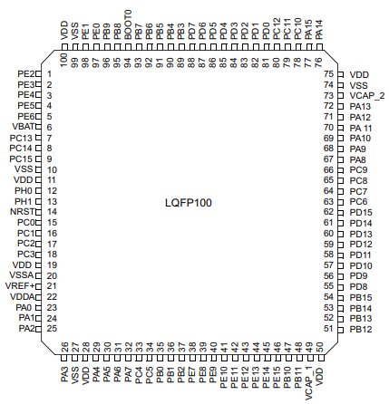
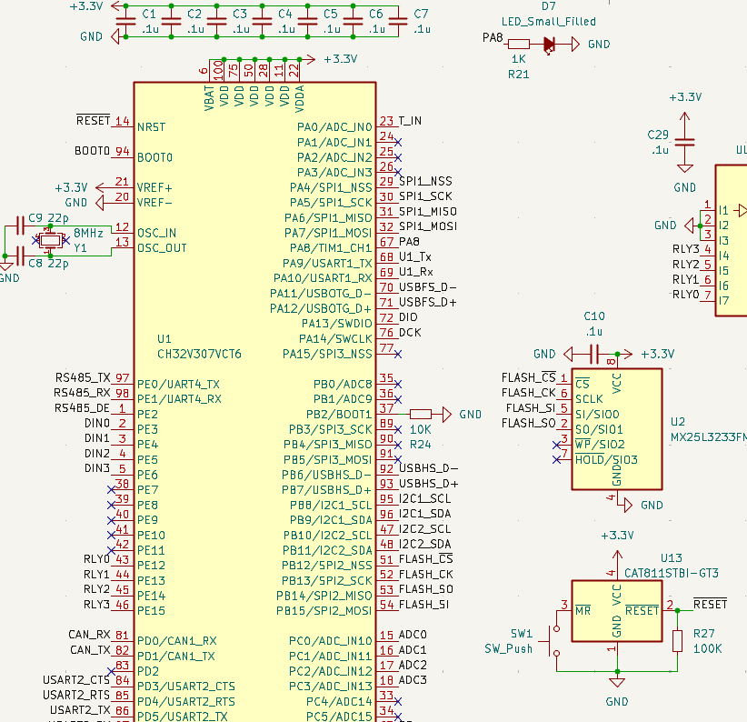
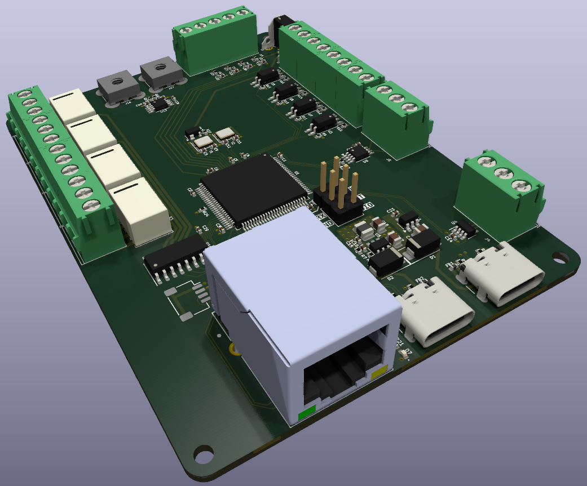
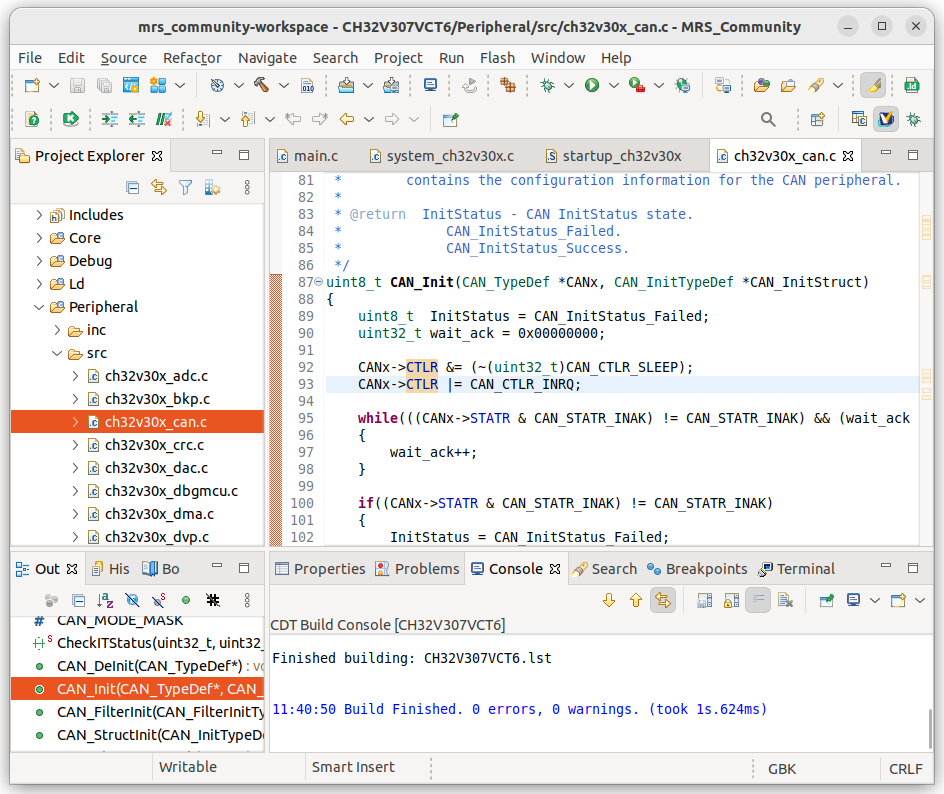
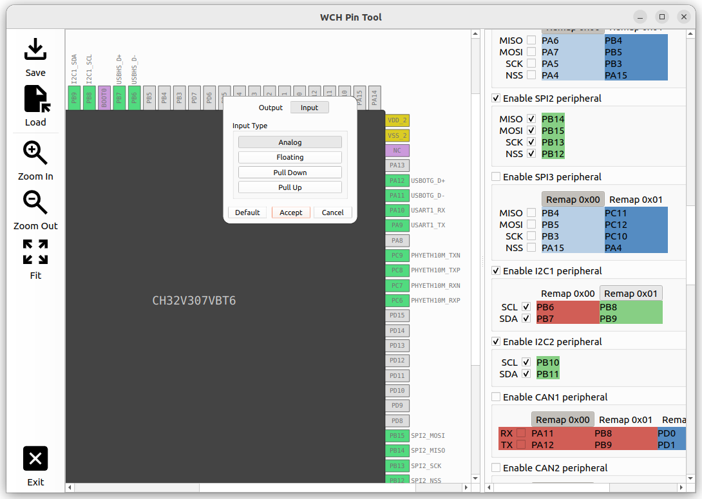

+++
author = "Martin Ribelotta"
title = "WCH RISC-V Microcontroller offers"
date = "2024-03-09"
description = "Overview of WCH RISC-V ecosystems"
layout = "single"
draft = false
tags = [
"MCU",
"microcontroller",
"embedded",
"WCH"
]
+++

WinChipHead (WCH) is a Chinese semiconductor company with extensive experience in the industry since its establishment in 2004. The company excels at providing solutions for embedded consumer applications, including USB hubs, Ethernet bridges, PCIe peripherals, and various types of microcontrollers. Especially in microcontrollers, the company has an interesting portfolio of parts that have unique characteristics.

Originally, they offered a plethora of 8-bit MCUs with a similar (but not the same) architecture to Microchip PIC14/16 MCUs and the MCS51 family. With this product, WCH has hit a home run by providing one of the most cost-effective MCS51-compatible MCUs with USB support.

The next milestone in this history is when WCH starts offering cortex-m3 MCUs that are extremely compatible with the STM32 line (especially the STM32f103 that was used in the mostly popular bluepill board). This movement was similar to what GigaDevice offered with their stm32-compatible line (later, more manufacturers would join this movement).


Intellectual property accusations: ST Microelectronics raised plagiarism allegations concerning these components (both the GD32F and the CH32F). However, there is no law preventing other manufacturers from producing compatible products.

Most Chinese STM32 "clone" manufacturers did not replicate the silicon itself. Instead, they acquired IPCores compatible with ST peripherals (and the ARM core, of course) or developed their own, drawing inspiration from publicly available ST datasheets.

For further insights into this situation, refer to the [olimex blog](https://olimex.wordpress.com/2015/11/09/chinese-clones-attack-stm32-microcontrollers). This entry discusses the case of GigaDevice but is applicable to any third-party company offering STM32-like processors.


The STM32-compatible CH32F microcontrollers gained widespread adoption in the low-cost board market and were well-received in numerous applications. However, challenges arose with restrictions on accessing Western technologies. Ambiguous limitations in their implementation raised doubts about the acquisition and utilization of intellectual property by Chinese companies.

Simultaneously, the RISC-V architecture, although struggling to gain traction in the field of application processors, was gaining supporters in the realm of embedded systems. Perhaps because of this, several Chinese companies opted to replace the ARM core in their embedded SoCs with a RISC-V core with similar characteristics.

What sets apart WCH's move in making their RISC-V chips compatible with STM32 is that they made a strong bet on a robust ecosystem and an offering of unique features not present in their counterparts, neither in third-party Chinese chips nor in ST's parts claiming compatibility.

For example, you can buy a mostly-compatible stm32f103 chip with a RISC-V core, the same pinout, and pheriperal mapping (ch32v203rbt6) but with an Ethernet 10 MB MAC+PHY in the chip. Additionally, the software stack running on the processor strongly resembles ST's Hardware Abstraction Layer (HAL), although it is slightly incompatible in both binary and code formats. This incompatibility may be intentional.

Another example is the CH32V307VCT6, which is a drop-in replacement for the STM32F103VCT6 but offers up to 8 UART/USARTs, one USB-OTG full speed and one USB host/device high speed, plus a 10/100/1G ethernet controller with a 10M ETH PHY, making it ideal for low-speed industrial ethernet-enabled applications.

But WCH not only offers enanced replacements for existing parts, but the company has also developed highly competent, unique MCU pieces such as the CH5xx and CH6xx series, which include, among others, the following components:

- [CH59x, CH58x and CH57x](https://www.wch-ic.com/products/CH592.html?): BLE-enabled MCUs (5.4, 5.3, and 4.2, respectively) with a miriad of peripherals like USB full speed, UART/USARS, etc.
- [CH569/CH565](https://www.wch-ic.com/products/CH569.html?): USB 3.0 Super Speed-enabled MCU with parallel interface (HSPI) capable of sending and receiving data up to 100 MSPS
- [CH64x](https://www.wch-ic.com/products/CH643.html?): USB-PD/QC (type C) capable MCU with led controller and peripheral coprocessor (PIOC that remembers the first RISC MCU series)

Next, I'll give a brief overview of my experience with the WCH chip series (for brevity's sake, I'll focus on the CH32V307 development kit).

## Experience using WCH MCU lines

My first impression of the CH32V30x chips was: "Wow, a new version of STM32F103 chips!" However, these chips conceal much more behind that facade of compatibility:

- A USB-OTG full-speed core with an additional USB high-speed host/device.
- Two CAN controllers (unfortunately not CAN-FD, but still, two CAN controllers without the bugs found in early STM32 pieces).
- 8 (yes, eight...) serial interfaces: 3 USARTs (with clock and RTS/CTS) and 5 UARTs (only TX and RX).
- Built-in gigabit Ethernet controller with support for 10M/100M/1G protocols. Additionally, the chip contains a 10M ETH PHY.
- FSMC (external bus memory) controller with complete compatibility with the STM32 series.
- DVP camera interface with some additions that make it easy to use as a parallel capture interface (anyone mention an ADC acquisition system?).

especially the two USB interfaces and 10MB ETH Phy, which were interesting for industrial applications and other harsh environments.

### Quick review of ch32v307

A quick view of the internal structure from the documentation reveals an architecture heavily inspired by (or intentionally following) the design of the STM32 MCU.

This is the architecture of **CH32V307**

Versus the architecture **STM32F407**

Both from corresponding datasheets

And a view of the pinout shows the deliberate compatibility with ST parts:

**CH32V307VCT6**

Versus **STM32F407VBT6**

Even if it's not a 1:1 replacement between the ST and WCH pieces, you can easily adapt the design to be compatible with both.

As an example, it is a design in kicad using the CH32V307 part in LQFP100 as a replacement for the STM32F105 part, with the addition of a 10 MB ETH connector.
The original design only had one USB-OTG and one Ethernet port with external mac+phy over SPI, but the new design integrates the ETH+PHY in the CH32 chip and provides an additional USB host/device.

### The software side

All programmable hardware must possess robust software support, encompassing libraries, development environments, support, and documentation.

WCH's offering not only stands tall compared to other providers but also shines in its own right by providing a comprehensive environment tailored to its chips (MounRiver Studio), along with a modified version of openOCD for its debugger (wlink), and an optimized version of gcc for the manufacturer's proprietary extensions (more on that later).

However, it is not always convenient to use integrated tools. Often, when working with heterogeneous teams, we encounter the need to deal with multiple build environments and CI/CD tools that do not integrate well with IDEs (although there are always ways to cope with this).

For this reason, I migrated to a command-line-based environment using tools like make/ninja along with cmake and plain gcc, and here is my list of considerations:

- All the code is available on GitHub/Gitee within the [openWCH project](https://github.com/openwch)
- The Makefile/CMake scripts are not very different from any other integrated project; you just need to have the compiler and tools in the PATH for it to work.
- As an IDE, I prefer VSCode, but many people I work with use tools like Notepad++, Vim, or Emacs (I was a Vim guy, but you get too accustomed to it, and then any other IDE bothers you).
- Mounriver provides precompiled command-line tools as separate packages, so obtaining them isn't a big issue, but if you wish to compile them yourself, it can be a bit of a headache.
- As for the openocd code, they send it to you if you request it. Additionally, there are [community efforts](https://github.com/jnk0le/openocd-wch) to maintain a codebase with the various updates that are released. This is ideal if your project requires compiling the tools from scratch, either for auditability reasons or for heterogeneous environments.
- The gcc compiler is a special case because its source code is not yet available (MounRiver is reportedly in negotiations with the project to eventually integrate it). Fortunately, the compiler provided by MounRiver works perfectly and comes in two versions: gcc8 if we want to use a legacy toolchain, and a new gcc12 to access new functionalities.
- In case you don't want to use the gcc toolchain provided by the manufacturer (or cannot do so because its architecture is not supported, such as Apple Silicon), you can smoothly use a standard toolchain from xpack-gcc for RISC-V. Of course, you won't have access to the specific features of this chip, such as proprietary packing instructions or defining functions as fast interrupts (although the latter can be manually emulated).

### The value of RISC-V in microcontrollers

ARM cores are predominant in the embedded industry, with multiple manufacturers licensing their architectures worldwide and competing against each other. However, in recent years, a new player has emerged in the market to challenge the dominance of the ARM architecture.

This player is RISC-V, and it plays a significant role not only because of its clean and modular architecture but also due to its open-source licensing model. Someone once said that RISC-V is to processor design what Linux is to software, and it seems they are right in that assessment.

I won't delve again into the geopolitical conditions that have enabled the incredible adoption of RISC-V in the Far East, as it is widely known. However, I will say that manufacturers like WCH have added incredible value to the RISC-V ecosystem in recent years by embracing this architecture over ARM or other proprietary ones.

Many manufacturers have chosen to purchase third-party RISC-V designs, while others, like WCH, have taken the risk and created their own implementation, with extensions tailored to the needs of their products. Nonetheless, the RISC-V cores provided in WCH products are compatible in their basic form with the official RISC-V specifications, thus allowing the use of standard third-party tools if we do not need or do not want to use the advanced features provided with the MounRiver toolchain.

Nonetheless, the RISC-V cores provided in WCH products are compatible in their basic form with the official RISC-V specifications, thus allowing the use of standard third-party tools if we do not need or do not want to use the advanced features provided with the MounRiver toolchain.

The innovative features that WCH incorporates into its products that are not in the RISC-V standard include:

- **Propietary interrupt controller that resembles ARMv7m NVIC (AKA PFIC)**: This is not an issue because WCH publishes the register information and its bits in the datasheet as well as in its openWCH libraries.
- **Extended compressed instructions for byte and half-word manipulation**: Well, to make use of this, the only thing left is to use the compiler provided by MounRiver or wait for them to integrate the changes into mainstream GCC.
- **Hardware stack save/restore on intrrupt (four levels of interrupt nesting)**: The compiler provided by MounRiver has extensions to mark a function as a fast interrupt, but if not available, it can be emulated with assembly code (basically, it's an ordinary function that ends with the'mret' instruction). If we still want to use the code as it is, we can make use of [patched versions of gcc](https://github.com/mengfanyuc/riscv-none-elf-gcc-xpack/releases/tag/v12.2.0-3) to include this behavior. You can see a thread that explains the behavior and the solution using a self-made gcc [here](https://github.com/cnlohr/ch32v003fun/issues/90)
- **Enance fast vector interrupt**: This feature is a custom CRS register that contains the interrupt vector for maximum performance (it does not require losing memory access to fetch the interrupt vector at the time of interrupt occurrence).

## Conclusion

WCH has fully entered the RISC-V microcontroller market with a series of impressive products that are not only familiar to those of us who have worked with the STM32 series but also incorporate many useful functionalities and a vibrant ecosystem.

In this article, we have only seen a small part of everything this manufacturer offers. We still have to explore the entire series of Bluetooth microcontrollers and chips with high-speed USB interfaces (such as the CH569), which are ideal for creating high-speed USB peripherals at incredibly low cost.

The only thing I miss in the WCH ecosystem is a configuration tool similar to ST's CubeMX... I hope to address that in the future... if my free time allows it.

